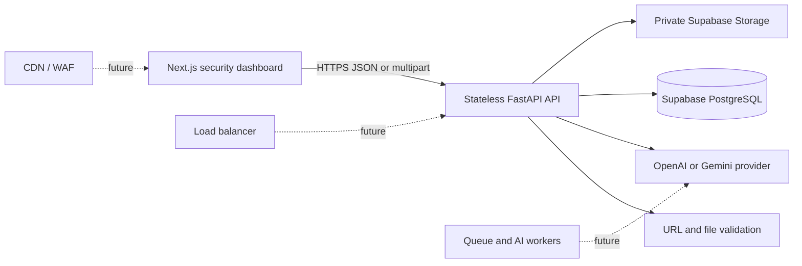

# ScamShield AI

> **Detect the scam before you take the bait.**

ScamShield AI is a security-focused, explainable scam detection MVP for suspicious messages, screenshots, URLs, and voice transcripts. It prioritizes a fast, polished end-to-end decision flow: submit content, receive an understandable risk assessment, and persist the result safely.

## The Problem

Scams exploit urgency, impersonation, social engineering, and requests for money or credentials. People often need a clear, trustworthy signal before they click a link, share an OTP, or send payment.

## The Solution

ScamShield AI combines deterministic security checks with structured AI output:

- **Message analysis** for phishing, banking, KYC, OTP, job, investment, delivery, romance, tech-support, and impersonation patterns.
- **Screenshot analysis** through a validated private upload and multimodal OpenAI or Gemini analysis.
- **URL analysis** that inspects only the URL string; the backend never fetches or visits user-provided targets.
- **Voice analysis** using browser-native speech recognition, then the same secure transcript analysis flow.
- **Explainable results** with a 0–100 score, risk level, scam category, confidence, red flags, explanation, and practical next actions.
- **Explicit demo mode** when no AI key is configured, keeping a live hackathon demonstration reliable without presenting fallback output as live AI.

## Architecture



PostgreSQL remains the source of truth. Screenshots are stored in Supabase Storage only; the database stores their object path, never the raw binary.

## Tech Stack

| Layer | Technology |
| --- | --- |
| Frontend | Next.js 16, React 19, TypeScript |
| Backend | FastAPI, Pydantic, SQLAlchemy async |
| Data | PostgreSQL on Supabase |
| Object storage | Private Supabase Storage bucket |
| AI | OpenAI Responses API or Gemini API |
| Local deployment | Docker Compose + PostgreSQL |
| Production target | Vercel frontend + Render Docker backend |

## Project Layout

```text
frontend/     Next.js dashboard and browser voice capture
backend/      FastAPI API, AI abstraction, persistence, migrations, tests
docker-compose.yml
render.yaml
```

## Run Locally

### Docker Compose

Docker Compose starts the frontend, backend, and a local PostgreSQL database:

```bash
docker compose up --build
```

- Dashboard: `http://localhost:3000`
- API docs: `http://localhost:8000/docs`
- Health: `http://localhost:8000/health`

The local stack starts in explicit demo mode unless you add an AI key to the backend environment.

To enable screenshot storage or a live AI provider in Docker, copy `backend/.env.example` to `backend/.env` and add the relevant backend-only values. Docker Compose reads this optional file without replacing the local PostgreSQL connection.

### Run Without Docker

```bash
cd backend
copy .env.example .env
pip install -r requirements.txt
alembic upgrade head
uvicorn app.main:app --reload
```

```bash
cd frontend
copy .env.example .env.local
npm install
npm run dev
```

## Environment Variables

### Backend

| Variable | Purpose |
| --- | --- |
| `DATABASE_URL` | Async PostgreSQL connection string; required for persistent history and statistics |
| `SUPABASE_URL` | Supabase project URL |
| `SUPABASE_ANON_KEY` | Reserved public-safe Supabase key; never required in browser code today |
| `SUPABASE_SERVICE_ROLE_KEY` | Backend-only privileged storage key |
| `SUPABASE_STORAGE_BUCKET` | Private storage bucket name; defaults to `scam-assets` |
| `AI_PROVIDER` | `auto`, `openai`, `gemini`, or `demo` |
| `OPENAI_API_KEY` / `OPENAI_MODEL` | OpenAI configuration |
| `GEMINI_API_KEY` / `GEMINI_MODEL` | Gemini configuration |
| `CORS_ORIGINS` | Comma-separated allowed frontend origins |
| `MAX_UPLOAD_BYTES` | Maximum screenshot size; defaults to 10 MiB |

With `AI_PROVIDER=auto`, ScamShield chooses OpenAI when `OPENAI_API_KEY` exists, then Gemini when `GEMINI_API_KEY` exists, and otherwise uses clearly labelled demo mode. A configured live provider returning an error returns a controlled API error; it does not silently switch to demo output.

### Frontend

| Variable | Purpose |
| --- | --- |
| `NEXT_PUBLIC_API_BASE_URL` | Public URL of the FastAPI backend |

Never place database credentials, service-role keys, or AI keys in a `NEXT_PUBLIC_` variable.

## Supabase Setup

The project includes `backend/migrations/versions/0001_create_analyses.py`. It creates:

- `analyses` with UUID IDs, nullable future `user_id`, input metadata, JSONB flags/actions, risk data, and timestamps.
- Indexes for `created_at`, `risk_level`, `scam_type`, and `user_id`.
- Row Level Security enabled with no public policy because the frontend never accesses the table directly.

Apply the migration with the privileged backend database connection:

```bash
cd backend
alembic upgrade head
```

For screenshot upload, configure `SUPABASE_URL` and `SUPABASE_SERVICE_ROLE_KEY`. The backend creates the `scam-assets` bucket as private on first valid upload. No public object URL is issued by the API.

When authentication is added, retain RLS and add ownership policies based on `user_id`; do not expose the service role to clients.

## API

All successful responses use:

```json
{
  "success": true,
  "data": {},
  "meta": {
    "request_id": "uuid",
    "provider": "openai",
    "mode": "live",
    "persisted": true
  }
}
```

| Method | Endpoint | Purpose |
| --- | --- | --- |
| `GET` | `/health` | Service and configuration status |
| `POST` | `/api/v1/analyze/text` | Analyze `{ "text": "..." }` |
| `POST` | `/api/v1/analyze/image` | Analyze multipart `file` |
| `POST` | `/api/v1/analyze/url` | Analyze `{ "url": "https://..." }` without fetching it |
| `POST` | `/api/v1/analyze/voice` | Analyze `{ "transcript": "..." }` |
| `GET` | `/api/v1/analyses?page=1&page_size=20` | Paginated analysis history |
| `GET` | `/api/v1/analyses/stats` | Dashboard statistics |
| `GET` | `/api/v1/analyses/{analysis_id}` | One persisted analysis |

## Security Decisions

- The API never resolves, opens, or fetches submitted URLs, preventing SSRF through URL analysis.
- Image uploads are limited to 10 MiB and validated by extension, declared MIME type, and decoded image format.
- Only PNG, JPG, JPEG, and WEBP are accepted.
- AI responses are constrained to structured JSON and validated by Pydantic; malformed output gets one safe JSON recovery attempt, then a controlled error.
- CORS uses an environment allowlist. API keys, OTPs, passwords, and full message content are excluded from structured logs.
- The API is stateless. Persistent data belongs in PostgreSQL and files belong in Supabase Storage.
- Rate limiting belongs at the Vercel/Render edge or WAF for horizontally consistent enforcement. Add a shared rate-limit backend before exposing high-volume public traffic.

## Testing

```bash
cd backend
pytest -q
```

The current suite covers health, text analysis, empty and invalid input, URL safety checks, file rejection, malformed provider output, persistence through an injected repository, and unavailable history behavior.

```bash
cd frontend
npm run typecheck
npm run build
```

## Deployment

### Vercel Frontend

1. Import the repository and set the root directory to `frontend`.
2. Set `NEXT_PUBLIC_API_BASE_URL` to the Render backend URL.
3. Deploy with the default Next.js build command.

### Render Backend

1. Create a Docker web service using `backend/Dockerfile`, or use `render.yaml`.
2. Set `DATABASE_URL`, `CORS_ORIGINS`, Supabase storage values, and one AI-provider key.
3. Run `alembic upgrade head` once as a pre-deploy or release command.
4. Keep `RUN_MIGRATIONS=false` on horizontally scaled API instances.

The container listens on `0.0.0.0:$PORT` and exposes `/health`.

## Scaling Strategy

The MVP runs synchronous AI analysis for a responsive hackathon demo. It is intentionally stateless:

1. Start with one FastAPI instance.
2. Add a load balancer and multiple FastAPI instances.
3. Move expensive AI analysis into a durable queue plus worker tier.
4. Add edge rate limiting, tracing, metrics, and a shared cache only when usage justifies them.

AI inference is the expensive bottleneck; PostgreSQL and object storage remain shared sources of truth throughout this evolution.

## Future Improvements

- Authenticated user history with ownership RLS policies.
- Audio-file transcription and private audio storage.
- Signed screenshot review links for authenticated users.
- Background workers, webhook notifications, and abuse-rate controls.
- Threat-intelligence feeds and verified brand-domain detection.
- Human escalation and official cybercrime-reporting integrations.
