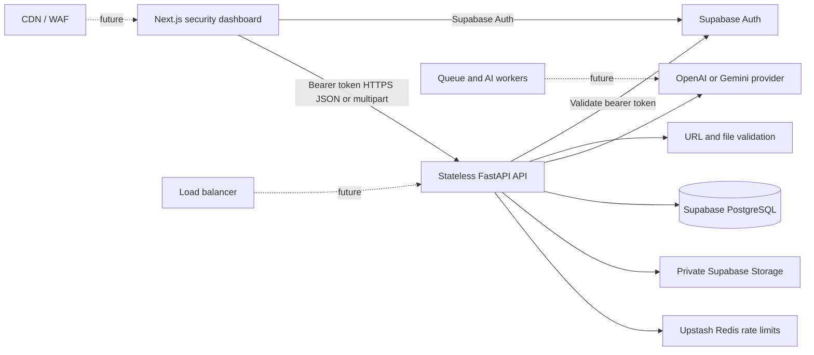

# ScamShield AI

> **Detect the scam before you take the bait.**

ScamShield AI is a security-focused, explainable scam detection MVP for suspicious messages, screenshots, URLs, and voice transcripts. It prioritizes a fast, polished end-to-end decision flow: submit content, receive an understandable risk assessment, and persist the result safely.

## The Problem

Scams exploit urgency, impersonation, social engineering, and requests for money or credentials. People often need a clear, trustworthy signal before they click a link, share an OTP, or send payment.

## The Solution

ScamShield AI combines deterministic security checks with structured AI output:

- **Mandatory account protection** through Supabase Auth: email/password sign-up and verification, Google OAuth, password reset, and logout.
- **Message analysis** for phishing, banking, KYC, OTP, job, investment, delivery, romance, tech-support, and impersonation patterns.
- **Screenshot analysis** through a validated private upload and multimodal OpenAI or Gemini analysis.
- **URL analysis** that inspects only the URL string; the backend never fetches or visits user-provided targets.
- **Voice analysis** using browser-native speech recognition, then the same secure transcript analysis flow.
- **Explainable results** with a 0–100 score, risk level, scam category, confidence, red flags, explanation, and practical next actions.
- **Explicit demo mode** when no AI key is configured, keeping a live hackathon demonstration reliable without presenting fallback output as live AI.

## Architecture



PostgreSQL remains the source of truth. Screenshots are stored in Supabase Storage only, under authenticated-user paths; the database stores their object path, never the raw binary.

## Tech Stack

| Layer | Technology |
| --- | --- |
| Frontend | Next.js 16, React 19, TypeScript |
| Backend | FastAPI, Pydantic, SQLAlchemy async |
| Data | PostgreSQL on Supabase |
| Object storage | Private Supabase Storage bucket |
| AI | OpenAI Responses API or Gemini API |
| Local deployment | Docker Compose + PostgreSQL |
| Production target | Vercel frontend + Render Docker backend |

## Project Layout

```text
frontend/     Next.js dashboard and browser voice capture
backend/      FastAPI API, AI abstraction, persistence, migrations, tests
docker-compose.yml
render.yaml
```

## Run Locally

### Docker Compose

Docker Compose starts the frontend, backend, and a local PostgreSQL database:

```bash
copy .env.example .env
copy backend\.env.example backend\.env
docker compose --env-file .env up --build
```

- Dashboard: `http://localhost:3000`
- API docs: `http://localhost:8000/docs`
- Health: `http://localhost:8000/health`

Set `NEXT_PUBLIC_SUPABASE_URL` and `NEXT_PUBLIC_SUPABASE_PUBLISHABLE_KEY` in the root `.env` before the Docker build. These are public browser values. Set backend-only credentials in `backend/.env`; Docker Compose reads it without replacing the local PostgreSQL connection.

The local stack starts in explicit demo mode unless you add an AI key to `backend/.env`. Rate limiting is disabled locally by default; set a real Upstash URL/token and `RATE_LIMIT_ENABLED=true` to exercise the shared production limiter.

### Run Without Docker

```bash
cd backend
copy .env.example .env
pip install -r requirements.txt
alembic upgrade head
uvicorn app.main:app --reload
```

```bash
cd frontend
copy .env.example .env.local
npm install
npm run dev
```

## Environment Variables

### Backend

| Variable | Purpose |
| --- | --- |
| `DATABASE_URL` | Async PostgreSQL connection string; required for persistent history and statistics |
| `SUPABASE_URL` | Supabase project URL |
| `SUPABASE_PUBLISHABLE_KEY` | Public Supabase key used only by the backend to validate bearer tokens; legacy `SUPABASE_ANON_KEY` remains a fallback |
| `SUPABASE_SERVICE_ROLE_KEY` | Backend-only privileged storage key |
| `SUPABASE_STORAGE_BUCKET` | Private storage bucket name; defaults to `scam-assets` |
| `UPSTASH_REDIS_REST_URL` / `UPSTASH_REDIS_REST_TOKEN` | Backend-only shared Redis rate-limiter credentials |
| `RATE_LIMIT_ENABLED` | Must be `true` in Render/production; disabled for a credential-free local demo |
| `RATE_LIMIT_*_PER_WINDOW` | Configurable health, user, scan, and image limits for the configured window |
| `AUTH_STRICT_SESSION_VALIDATION` | Checks the verified JWT `session_id` against `auth.sessions`; defaults on in production and off outside production |
| `LOCAL_AUTH_SCHEMA_ENABLED` | Local-only development shim for Docker PostgreSQL; keep `false` in Supabase/Render |
| `AI_PROVIDER` | `auto`, `openai`, `gemini`, or `demo` |
| `OPENAI_API_KEY` / `OPENAI_MODEL` | OpenAI configuration |
| `GEMINI_API_KEY` / `GEMINI_MODEL` | Gemini configuration |
| `CORS_ORIGINS` | Comma-separated allowed frontend origins |
| `MAX_UPLOAD_BYTES` | Maximum screenshot size; defaults to 10 MiB |

With `AI_PROVIDER=auto`, ScamShield chooses OpenAI when `OPENAI_API_KEY` exists, then Gemini when `GEMINI_API_KEY` exists, and otherwise uses clearly labelled demo mode. A configured live provider returning an error returns a controlled API error; it does not silently switch to demo output.

### Frontend

| Variable | Purpose |
| --- | --- |
| `NEXT_PUBLIC_API_BASE_URL` | Public URL of the FastAPI backend |
| `NEXT_PUBLIC_SUPABASE_URL` | Public Supabase project URL |
| `NEXT_PUBLIC_SUPABASE_PUBLISHABLE_KEY` | Public Supabase browser key |
| `NEXT_PUBLIC_SITE_URL` | Current frontend origin, such as `http://localhost:3000` |
| `NEXT_PUBLIC_TURNSTILE_SITE_KEY` | Optional public Cloudflare Turnstile site key; required when CAPTCHA is enabled in Supabase Auth |

Never place database credentials, service-role keys, or AI keys in a `NEXT_PUBLIC_` variable.

## Supabase Setup

The project includes `backend/migrations/versions/0001_create_analyses.py` and `0002_add_analysis_user_ownership.py`. Together they create:

- `analyses` with UUID IDs, nullable legacy `user_id`, input metadata, JSONB flags/actions, risk data, and timestamps.
- A `user_id -> auth.users(id)` foreign key using `ON DELETE SET NULL`, preserving legacy rows while requiring every new API analysis to have a verified owner.
- Indexes for `created_at`, `risk_level`, `scam_type`, `user_id`, and `(user_id, created_at)`.
- Row Level Security enabled with no public policy because the frontend never accesses the table directly.

Apply the migration with the privileged backend database connection:

```bash
cd backend
alembic upgrade head
```

For local PostgreSQL, `LOCAL_AUTH_SCHEMA_ENABLED=true` creates lightweight local `auth.users` IDs only so Supabase-verified accounts can satisfy the development foreign key. It is disabled in Render and never replaces Supabase Auth in production.

For screenshot upload, configure `SUPABASE_URL` and `SUPABASE_SERVICE_ROLE_KEY`. The backend creates the `scam-assets` bucket as private on first valid upload. Objects are stored at `users/{user_id}/screenshots/...`; no public object URL is issued by the API.

### Configure Supabase Auth

ScamShield is a public application. It accepts valid Gmail, Outlook, corporate, and other email domains; there is no client-only domain filter. Existing Google users remain unchanged, and Supabase automatically links a new Google identity only when the provider supplies the same verified email address.

1. In **Authentication → Providers**, enable Email and keep email confirmation enabled.
2. In **Authentication → URL Configuration**, set the Site URL and add `http://localhost:3000/auth/callback` plus the Vercel `https://<your-domain>/auth/callback` redirect URL.
3. Copy the project URL and **publishable** key from the Connect dialog to the root `.env` and backend environment. Never use the service-role key in the frontend.
4. The default Supabase email sender is rate-limited for development. Configure custom SMTP before production email volume. See the [password authentication guide](https://supabase.com/docs/guides/auth/passwords).

Before production launch, also set the minimum password length to at least 12, enable leaked-password protection, and review the hosted Auth rate limits. For bot protection, create a Cloudflare Turnstile widget, configure its secret in Supabase Authentication bot protection, and deploy the matching site key as `NEXT_PUBLIC_TURNSTILE_SITE_KEY`. Do not enable CAPTCHA in Supabase before the site key is deployed, or email/password forms will fail closed. New Free-plan projects using the default SMTP cannot customize auth templates, so production-branded verification and recovery email requires custom SMTP.

The UI provides signup, verification resend, password login, generic account recovery, protected password reset, Google OAuth, and global logout. Password-reset links create a short-lived recovery state, and a successful reset revokes existing sessions before requiring a new login. Supabase owns password hashing, one-time token hashing and expiry, email uniqueness, PKCE, OAuth state, and verified-email identity linking; ScamShield does not duplicate those mechanisms.

### Configure Google Login

1. Create a Google Cloud **Web application** OAuth client.
2. Add `http://localhost:3000` and the Vercel domain as authorized JavaScript origins.
3. Add `https://<project-ref>.supabase.co/auth/v1/callback` as the authorized redirect URI.
4. In Supabase **Authentication → Providers → Google**, enable Google and enter the Google client ID and secret. Keep the Google secret in Google/Supabase only, never in this repository. See the [Google provider guide](https://supabase.com/docs/guides/auth/social-login/auth-google).

### Configure Upstash Rate Limiting

1. Create an Upstash Redis database and copy its REST URL and REST token.
2. Add both values only to the backend/Render environment and set `RATE_LIMIT_ENABLED=true`.
3. The service applies fixed-window limits shared by every API instance: `30/minute/IP` for `/health`, `60/minute/user` for authenticated routes, `10/minute/user` for text/URL/voice scans, and `4/minute/user` for image scans.
4. Protected endpoints fail closed with `503` when Redis is unavailable; `/health` exposes a degraded limiter state. See the [Upstash Python SDK guide](https://upstash.com/docs/redis/sdks/py/gettingstarted).

## API

All successful responses use:

```json
{
  "success": true,
  "data": {},
  "meta": {
    "request_id": "uuid",
    "provider": "openai",
    "mode": "live",
    "persisted": true
  }
}
```

| Method | Endpoint | Purpose |
| --- | --- | --- |
| `GET` | `/health` | Service and configuration status |
| `POST` | `/api/v1/analyze/text` | Analyze `{ "text": "..." }` |
| `POST` | `/api/v1/analyze/image` | Analyze multipart `file` |
| `POST` | `/api/v1/analyze/url` | Analyze `{ "url": "https://..." }` without fetching it |
| `POST` | `/api/v1/analyze/voice` | Analyze `{ "transcript": "..." }` |
| `GET` | `/api/v1/analyses?page=1&page_size=20` | Paginated analysis history |
| `GET` | `/api/v1/analyses/stats` | Dashboard statistics |
| `GET` | `/api/v1/analyses/{analysis_id}` | One persisted analysis |

`/health` is public. Every `/api/v1/*` endpoint requires `Authorization: Bearer <Supabase access token>`. History, statistics, details, database writes, and screenshot object paths are scoped to the verified user. A request for another user's analysis returns `404`.

## Security Decisions

- The API never resolves, opens, or fetches submitted URLs, preventing SSRF through URL analysis.
- Image uploads are limited to 10 MiB and validated by extension, declared MIME type, and decoded image format.
- Only PNG, JPG, JPEG, and WEBP are accepted.
- AI responses are constrained to structured JSON and validated by Pydantic; malformed output gets one safe JSON recovery attempt, then a controlled error.
- CORS uses an environment allowlist. API keys, OTPs, passwords, and full message content are excluded from structured logs.
- FastAPI validates every bearer token against Supabase Auth before it authorizes an analysis or reads stored data.
- Redis-backed limits are atomic and shared between Render instances. Rate-limit responses use the normal error envelope, HTTP `429`, and `Retry-After`; protected routes fail closed if the shared limiter is unavailable.
- The API is stateless. Persistent data belongs in PostgreSQL and files belong in Supabase Storage.

## Testing

```bash
cd backend
pytest -q
```

The suites cover health, authenticated text analysis, missing/invalid tokens, verified and disabled account handling, email normalization, password policy, callback open-redirect prevention, empty and invalid input, URL safety checks, file rejection, malformed provider output, user-owned persistence and history isolation, scoped image paths, and rate-limit thresholds/outages.

```bash
cd frontend
npm test
npm run typecheck
npm run build
```

## Deployment

### Vercel Frontend

1. Import the repository and set the root directory to `frontend`.
2. Set `NEXT_PUBLIC_API_BASE_URL`, `NEXT_PUBLIC_SUPABASE_URL`, `NEXT_PUBLIC_SUPABASE_PUBLISHABLE_KEY`, `NEXT_PUBLIC_SITE_URL`, and optionally `NEXT_PUBLIC_TURNSTILE_SITE_KEY`.
3. Add the deployed `https://<vercel-domain>/auth/callback` URL in Supabase Auth before enabling Google or password-reset emails.
4. Deploy with the default Next.js build command.

### Render Backend

1. Create a Docker web service using `backend/Dockerfile`, or use `render.yaml`.
2. In Supabase **Connect**, copy the **Session pooler** URI and use it unchanged for `DATABASE_URL`. Render is IPv4-only, while Supabase's direct database endpoint is IPv6-only without the paid IPv4 add-on. The application converts the copied `postgres://` or `postgresql://` URI to its async SQLAlchemy dialect automatically.
3. Set `CORS_ORIGINS`, `SUPABASE_URL`, `SUPABASE_PUBLISHABLE_KEY`, `SUPABASE_SERVICE_ROLE_KEY`, `UPSTASH_REDIS_REST_URL`, `UPSTASH_REDIS_REST_TOKEN`, `RATE_LIMIT_ENABLED=true`, and one AI-provider key.
4. Run `alembic upgrade head` once as a pre-deploy or release command.
5. Keep `RUN_MIGRATIONS=false` on horizontally scaled API instances.

The container listens on `0.0.0.0:$PORT` and exposes `/health`.

## Scaling Strategy

The MVP runs synchronous AI analysis for a responsive hackathon demo. It is intentionally stateless:

1. Start with one FastAPI instance.
2. Add a load balancer and multiple FastAPI instances; auth, ownership data, uploads, and Upstash rate limits remain shared.
3. Move expensive AI analysis into a durable queue plus worker tier.
4. Add edge/WAF rate limiting, tracing, metrics, and a shared cache only when usage justifies them.

AI inference is the expensive bottleneck; PostgreSQL and object storage remain shared sources of truth throughout this evolution.

## Future Improvements

- Audio-file transcription and private audio storage.
- Signed screenshot review links for authenticated users.
- Background workers, webhook notifications, and edge/WAF abuse controls.
- Threat-intelligence feeds and verified brand-domain detection.
- Human escalation and official cybercrime-reporting integrations.
